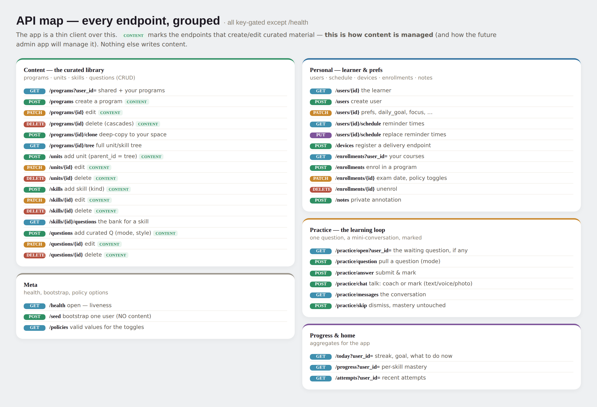

# Backend API



The mobile app is a thin client over this API. Everything is gated by the
`X-API-Key` header except `GET /health`. Writes take `?user_id=` for ownership checks.

> **Content rule:** the **CONTENT**-tagged endpoints below are the *only* way curriculum
> content is created or changed. Content lives in the database, never in code. (Schema:
> `DATABASE_SCHEMA.md`.) To author a curriculum, write a throwaway script that holds the
> data and POSTs it — don't commit content into `app/`.

## Content — the curated library  ·  *this is how content is managed*
```
GET    /programs?user_id=          shared + your programs
POST   /programs                   create a program        {title, subject, level, region, description, owner_id}
PATCH  /programs/{id}?user_id=      edit
DELETE /programs/{id}?user_id=      delete (cascades to units/skills/questions/enrollments)
POST   /programs/{id}/clone?user_id=  deep-copy into your space
GET    /programs/{id}/tree          full unit/skill tree

POST   /units?user_id=              add unit   {program_id, parent_id?, title, content, position}
PATCH  /units/{id}?user_id=         edit
DELETE /units/{id}?user_id=         delete

POST   /skills?user_id=             add skill  {program_id, unit_id?, name, description, kind, position}
PATCH  /skills/{id}?user_id=        edit       (kind ∈ math|code|stats|concept)
DELETE /skills/{id}?user_id=        delete
GET    /skills/{id}/questions       the bank for a skill

POST   /questions?user_id=          add curated Q  {skill_id, text, answer, commentary, mode, style, position}
PATCH  /questions/{id}?user_id=     edit            (mode ∈ on_the_go|short_drill|problem)
DELETE /questions/{id}?user_id=     delete
```

## Personal — learner & preferences
```
GET/POST/PATCH /users[/{id}]        the learner; prefs, daily_goal, focus_enrollment_id, timezone…
GET/PUT  /users/{id}/schedule       reminder clock-times (the device schedules the actual notifications)
POST   /devices                     register a delivery endpoint (push/telegram/console)
GET/POST/PATCH/DELETE /enrollments  enrol; set exam_date + policy toggles (marking, question_source, cooldown)
POST   /notes                       a private annotation on content
```

## Practice — the learning loop
```
GET    /practice/open?user_id=      the waiting question, if any (a nudge lands here)
POST   /practice/question           pull a question        {user_id, enrollment_id?, mode?}
POST   /practice/answer             submit & mark          {user_id, text, attempt_id?}
POST   /practice/chat               talk: coach or mark    {user_id, text, modality (text|voice|photo), images?}
GET    /practice/messages           the conversation
POST   /practice/skip?user_id=      dismiss (mastery untouched)
```

## Progress, home & meta
```
GET    /today?user_id=              streak, daily goal, what to do now
GET    /progress?user_id=           per-skill mastery
GET    /attempts?user_id=           recent attempts
GET    /health                      open — liveness
POST   /seed                        bootstrap ONE user (no content)
GET    /policies                    valid values for the enrollment toggles + modes
```
