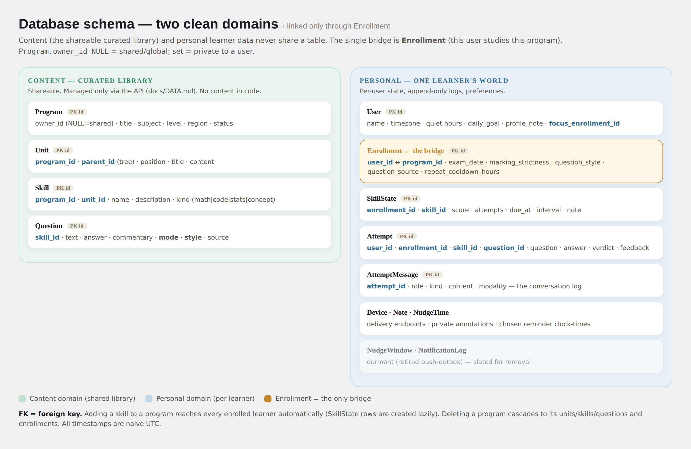

# Database schema

Two cleanly separated domains. They share **no** table; the only bridge is
**`Enrollment`** (this user studies this program).

## Content — the curated library (shareable)
Managed **only through the API** (see `BACKEND_API.md`). Never baked into code.

| Table | Key columns | Notes |
|---|---|---|
| `Program` | `owner_id` (NULL = shared / set = private), title, subject, level, region, status | a curriculum |
| `Unit` | `program_id`, `parent_id` (recursive tree), position, title, content | chapters / sections |
| `Skill` | `program_id`, `unit_id`, name, description, **`kind`** (`math` \| `code` \| `stats` \| `concept`) | an atomic masterable thing |
| `Question` | `skill_id`, text, answer, commentary, **`mode`** (`on_the_go` \| `short_drill` \| `problem`), **`style`**, source | the curated bank |

`style` is the on-the-go flavour: `trap \| misconception \| true_false \| concept \| counterexample \| example \| mcq`. Problem answers spell out the steps.

## Personal — one learner's world
| Table | Key columns | Notes |
|---|---|---|
| `User` | name, timezone, quiet hours, daily_goal, profile_note, `focus_enrollment_id` | the learner + prefs |
| `Enrollment` ← **bridge** | `user_id` ↔ `program_id`, exam_date, marking_strictness, question_style, question_source, repeat_cooldown_hours | the only link between the domains |
| `SkillState` | `enrollment_id`, `skill_id`, score, attempts, due_at, interval, note | per-skill adaptive memory |
| `Attempt` | `user_id`, `enrollment_id`, `skill_id`, `question_id`, **`mode`**, question, answer, verdict, feedback | append-only event log |
| `AttemptMessage` | `attempt_id`, role, kind, content, modality | the conversation about one question |
| `PracticeOverride` | `user_id`, kind (`pause`\|`focus`), `unit_id`? \| `skill_id`?, `expires_at` | temporary, self-expiring steer set on the Course tab |
| `Device` · `Note` · `NudgeTime` | — | delivery endpoints · private annotations · chosen reminder clock-times |

**Dormant (slated for removal):** `NudgeWindow`, `NotificationLog` (the retired server-push outbox).

## Rules of thumb
- Adding a skill to a program reaches every enrolled learner automatically
  (`SkillState` rows are created lazily on first selection).
- Deleting a `Program` cascades to its units/skills/questions and enrollments.
- All timestamps are naive UTC. Schema is built by Alembic migrations on startup.
